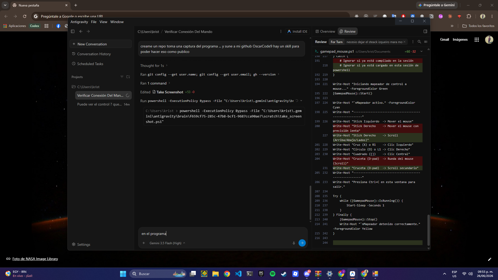

# Gamepad Mouse Pro 🎮🖱️

Una aplicación de escritorio nativa para Windows, súper ligera y con diseño oscuro premium, que te permite controlar el cursor del mouse y hacer scroll usando un control de PlayStation 4 (DualShock 4) conectado por Bluetooth.

## 📸 Captura de Pantalla

## ✨ Características

- 🎨 **Interfaz de Usuario Premium**: Estilo oscuro basado en Catppuccin Mocha con transiciones y colores cómodos.
- ⚡ **Auto-Conexión Inteligente**: Detecta cuando tu mando está conectado y activa el control del mouse automáticamente al abrir el programa o encender el control.
- 🔄 **Reconexión Automática**: Si apagas tu control o se apaga el Bluetooth, el programa se pausa y se reactiva solo al volver a encenderlo.
- 🕹️ **Mapeo Avanzado**:
  - **Stick Izquierdo**: Movimiento del mouse (aceleración progresiva).
  - **Stick Derecho**: Desplazamiento (Scroll) vertical y horizontal fluido.
  - **Cruz (X) / R1**: Clic Izquierdo del mouse.
  - **Círculo (O) / L1**: Clic Derecho del mouse.
  - **Cuadrado ([])**: Clic Central (Middle Click).
  - **Cruceta (D-pad)**: Scroll vertical secundario.
- ⚙️ **Configuración en Tiempo Real**: Ajusta la velocidad del mouse y la velocidad del scroll directamente desde los deslizadores de la pantalla.
- 🍃 **Cero Dependencias**: Escrita en C# nativo para Windows Forms. No requiere Node.js, Python, ni descargas externas. Ocupa 0% de CPU en reposo.

## 🚀 Cómo Compilar y Ejecutar

Este proyecto está diseñado para compilarse en cualquier computadora con Windows sin necesidad de instalar entornos pesados de desarrollo como Visual Studio.

1. Descarga este repositorio.
2. Haz doble clic en el archivo `compile.bat`.
3. Esto utilizará el compilador nativo de C# de Windows (`csc.exe`) y creará el ejecutable `GamepadMousePro.exe` al instante.
4. Ejecuta `GamepadMousePro.exe` con tu mando conectado por Bluetooth. ¡Y listo!

## 🛠️ Tecnologías

- **Lenguaje**: C# 5.0 (Compatible con .NET Framework 4.0 o superior).
- **Entorno**: Windows API nativo (`winmm.dll`, `user32.dll`).
